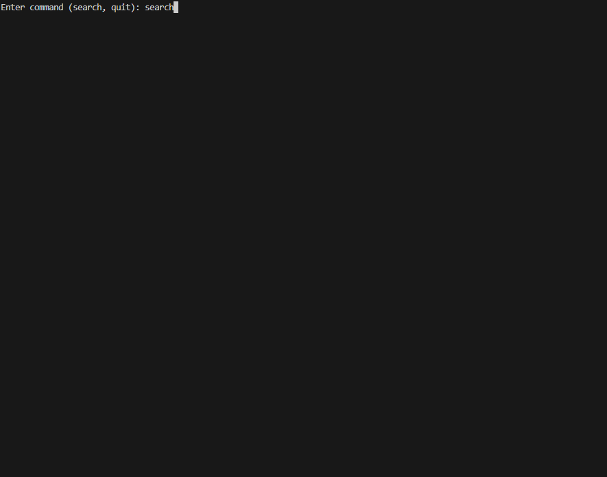
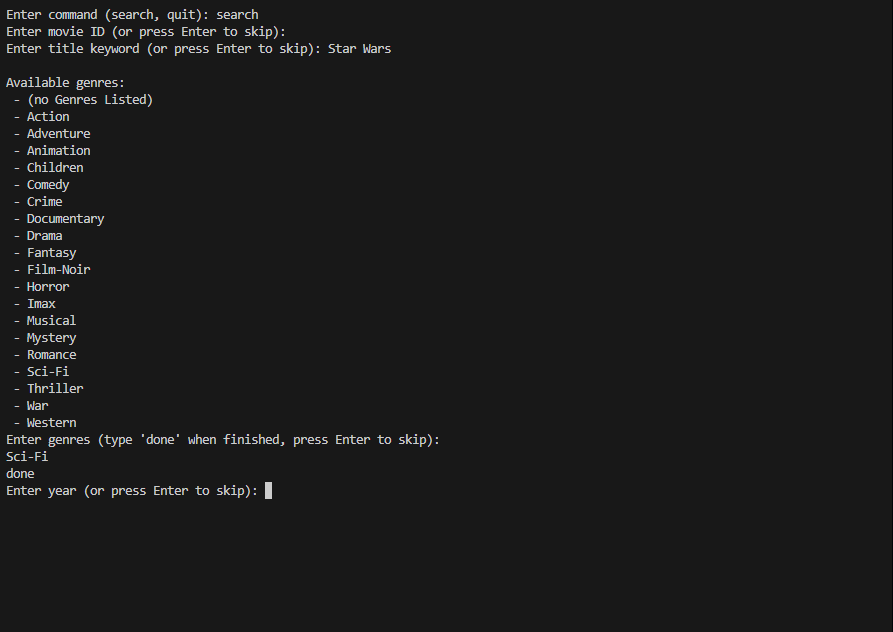
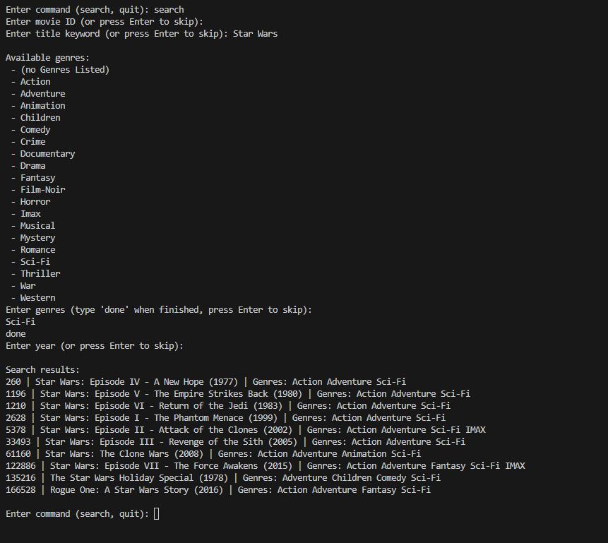

# Movie Searcher

A command-line application in C++ to search and filter movies from a dataset.  
Users can search by movie ID, title keyword, genre(s), and release year.  
This program makes use of the latest small MovieLens dataset containing 100,000
ratings. Specifically, it uses the movies.csv` file which contains movie IDs, titles, years, 
and genres. Link: https://grouplens.org/datasets/movielens/latest/

---

## Features
- Search movies by ID, title keyword, genres, and year  
- Case-insensitive search  
- Displays up to 10 matching results at a time  
- Uses CSV dataset (`movies.csv`) for movie data  

---

## Project Structure

```text
.  # Root
│
├── src/
│   └── movie-loader.cpp    # Main application
├── images/
│   └── start.png    # Start image
│   └── search.png   # Search image
│   └── result.png   # Result image
├── data
│   └── movies.csv          # Dataset file
├── Makefile                # Build instructions
├── README.md               # Project documentation
├── LICENSE                 # License file
└── .gitignore              # Files ignored by Git
```

---

## Requirements
- C++17 compatible compiler (g++, clang++, etc.)

---

## How to Build and Run

1. Build the project:

```bash
make
```


2. Run the application:

```bash
./movie-loader
```

3. Clean build artifacts:

```bash
make clean
```

---

## Screenshots/Example Usage

### Initial Prompt


### Searching Prompt


### Result


---

## License

This project is licensed under the MIT License – see the LICENSE
file for details.


